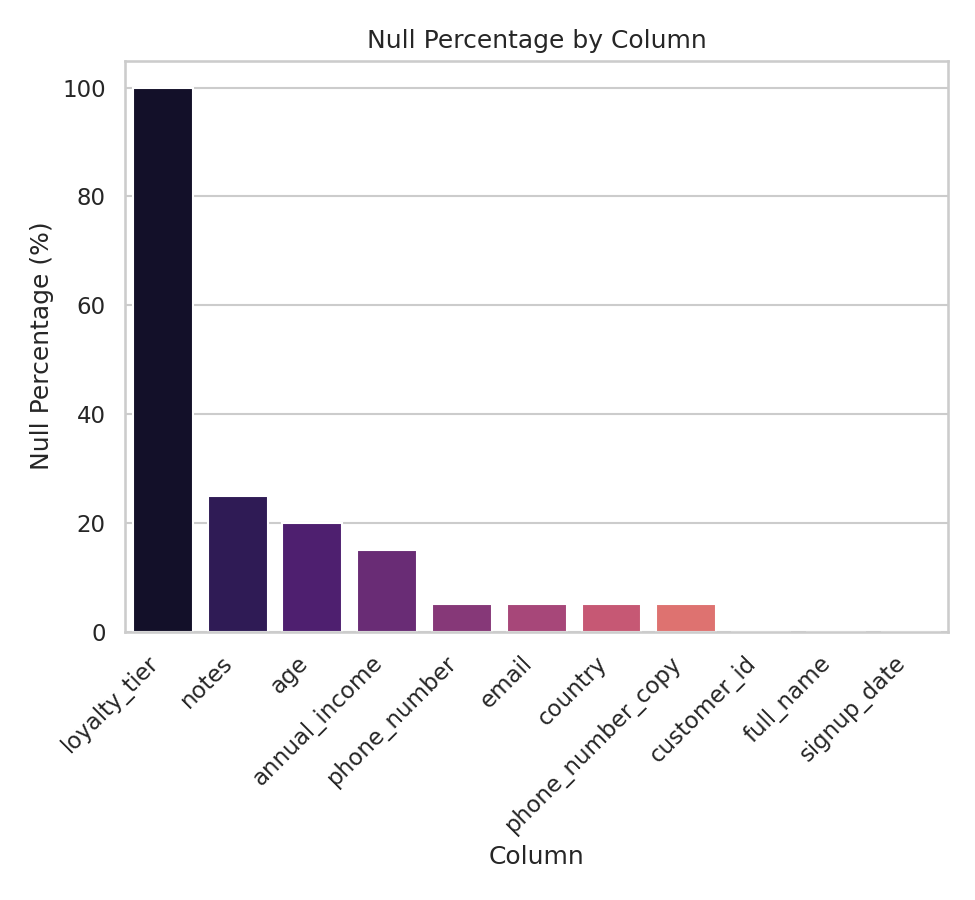
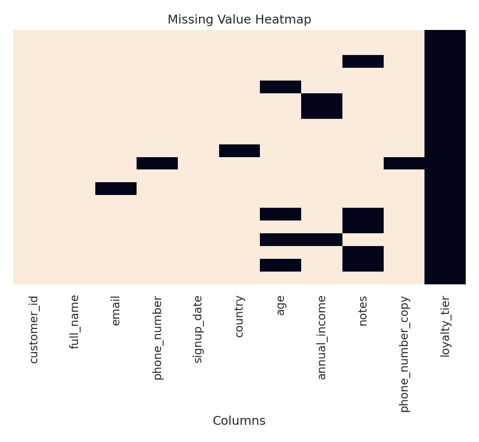
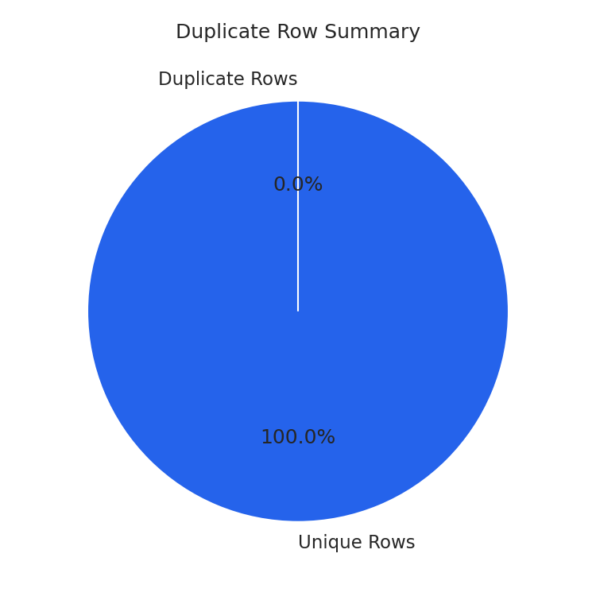
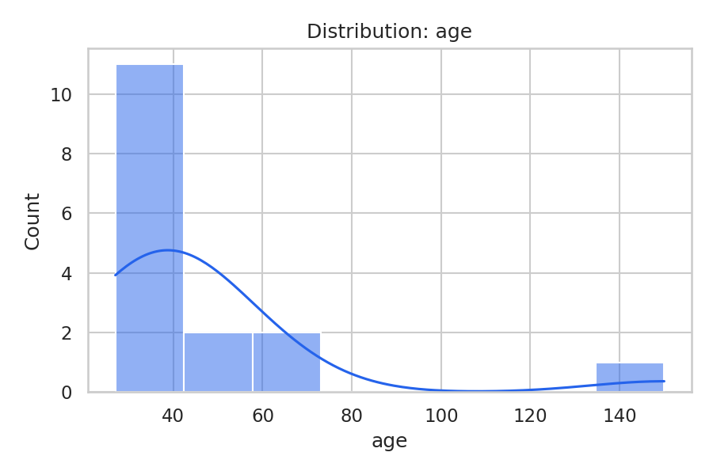

# 🧪 Data Quality Checker & CSV Validator

A professional, production-quality Python toolkit for validating, profiling, cleaning, and reporting on the quality of CSV datasets — built for Data Engineers and Data Scientists who need fast, trustworthy insight into a dataset before it enters a pipeline.


---

## ✨ Features

### 📥 Robust CSV Import
- Loads any `.csv` / `.tsv` / `.txt` file
- Auto-detects file encoding (`charset-normalizer` → `chardet` → fallback chain)
- Auto-detects the delimiter (comma, semicolon, tab, pipe)
- Streams large files in chunks to bound memory usage
- Validates file existence/format and fails gracefully on corrupted files

### 🔍 Data Validation
Detects and reports:
- Missing values (with null % per column)
- Duplicate rows and duplicate columns
- Suspected data-type mismatches
- Invalid email addresses and phone numbers
- Invalid / unparsable date formats
- Negative values in numeric columns
- Completely empty columns
- Leading/trailing whitespace
- Unexpected special characters
- Unique value counts and duplicate-value frequency

### 📊 Data Profiling
- Row/column counts, column names & dtypes
- Memory usage (human-readable)
- Missing-value statistics per column
- Most frequent values per column
- Numeric summary statistics (mean, std, quartiles, min/max)
- Categorical summary statistics (unique count, top value, average length)

### 🧹 Data Cleaning (opt-in)
- Remove duplicate rows
- Trim leading/trailing whitespace
- Standardize text casing (`lower` / `upper` / `title`)
- Convert date columns to a target format
- Fill missing values (`mean`, `median`, `mode`, `constant`, `ffill`, `bfill`, or `drop`)
- Export the cleaned dataset to CSV, with a full audit log of every operation performed

### 📑 Multi-Format Reporting
- **Console** — a clean, tabulated summary (uses [`rich`](https://github.com/Textualize/rich) if installed, plain-text fallback otherwise)
- **CSV** — a flat per-column quality report
- **JSON** — the full structured report (profile + validation + cleaning log)
- **HTML** — a styled, shareable report with summary cards and tables

### 📈 Visualizations (optional, `--visualize`)
- Missing-value heatmap
- Null-percentage bar chart
- Duplicate-row summary pie chart
- Numeric column distribution histograms

### 🪵 Logging
Rotating file + console logs covering file loading, validation progress, cleaning operations, report generation, and errors.

---

## 📦 Installation

```bash
# Clone the repository
[(https://github.com/klsatapathy/data-science-core-toolkit.git)]
cd data-science-core-toolkit/python/Data_Quality_Checker

# (Recommended) create a virtual environment
python3 -m venv venv
source venv/bin/activate      # Windows: venv\Scripts\activate

# Install dependencies
pip install -r requirements.txt

# Optional: install as an editable package (adds the `data-quality-checker` CLI command)
pip install -e .
```

**Requirements:** Python 3.12+

---

## 🚀 Usage

### Quick start

```bash
python main.py --input sample_data/sample_customers.csv
```

### Full example: all report formats + visualizations

```bash
python main.py \
  --input sample_data/sample_customers.csv \
  --output-dir reports \
  --formats console csv json html \
  --visualize
```

### Clean the dataset and export it

```bash
python main.py \
  --input sample_data/sample_customers.csv \
  --clean \
  --remove-duplicates \
  --trim-whitespace \
  --standardize-case title \
  --fill-strategy mode \
  --export-cleaned reports/cleaned_dataset.csv \
  --formats console html
```

### If installed as a package

```bash
data-quality-checker --input data.csv --formats console json
```

### CLI Reference

| Argument | Description | Default |
|---|---|---|
| `-i, --input` | Path to the input CSV file **(required)** | — |
| `-o, --output-dir` | Directory for generated reports/charts | `reports/` |
| `-f, --formats` | One or more of `console csv json html` | `console` |
| `-v, --verbosity` | `DEBUG`, `INFO`, `WARNING`, `ERROR`, `CRITICAL` | `INFO` |
| `--visualize` | Generate PNG charts | off |
| `--clean` | Enable the cleaning pipeline | off |
| `--remove-duplicates` | Drop fully duplicated rows | off |
| `--trim-whitespace` | Trim whitespace on text columns | off |
| `--standardize-case` | `lower`, `upper`, `title`, `none` | none |
| `--fill-strategy` | `mean`, `median`, `mode`, `constant`, `ffill`, `bfill`, `drop` | none |
| `--fill-constant` | Value used when `--fill-strategy=constant` | — |
| `--export-cleaned` | Output path for the cleaned CSV | `<output-dir>/cleaned_dataset.csv` |

Run `python main.py --help` for the full, always-up-to-date option list.

---

## 🌐 Web Application (Streamlit)

The same backend that powers the CLI also powers an interactive Streamlit web app — no business logic is duplicated between the two; the app is a thin UI layer over the existing `data_quality_checker` package.

```bash
pip install -r requirements.txt
python -m streamlit run app.py
```

Then open the URL Streamlit prints (typically `http://localhost:8501`).

**Pages** (sidebar navigation, auto-generated by Streamlit from the `pages/` folder):


## 🌐 Live Demo

Deployed at:[ _Data Quality Checker_](https://data-science-core-toolkit-4xhwvxx3wjzuhwguhazmwa.streamlit.app/)


| Page | Description |
|---|---|
| 🏠 Home | Project overview, features, and workflow |
| 📂 Upload Dataset | Upload a CSV or load the bundled sample; see filename, size, rows, columns |
| 👀 Dataset Preview | Head/tail rows, full dataframe, column dtypes |
| ✅ Data Validation | Dashboard of all validation checks with metric cards & status badges |
| 📊 Data Profiling | Row/column stats, memory usage, missing %, unique & frequent values, numeric/categorical summaries |
| 🧹 Data Cleaning | Configure and apply cleaning ops, preview before/after, download cleaned CSV |
| 📈 Visualizations | Missing-value heatmap, null % chart, duplicate summary, distribution plots |
| 📄 Reports | Generate and preview CSV/JSON/HTML reports, with download buttons |
| ⬇ Download Center | One place to download every artifact generated this session (or all as a ZIP) |

**Architecture note:** `app.py` and `pages/*.py` contain only UI code. All data-quality logic is delegated through `streamlit_utils/pipeline.py`, a thin wrapper that calls the exact same `CSVLoader`, `DataValidator`, `DataProfiler`, `DataCleaner`, `ReportGenerator`, and `Visualizer` classes used by the CLI (`data_quality_checker/cli.py`). `streamlit_utils/ui.py` holds only presentation helpers (metric cards, badges, CSS, sidebar status) with no data-quality logic. Uploaded files are written to a per-session temp directory so the backend's file-based `CSVLoader` (which needs a real path for encoding/delimiter detection) works unchanged.


## 🖼️ Screenshots

> Sample reports generated from `sample_data/sample_customers.csv` are included in [`docs/sample_reports/`](docs/sample_reports/) — open `data_quality_report.html` in a browser for the full interactive-style report.

| Console Report | HTML Report |
|---|---|
| Tabulated per-column quality summary printed to the terminal | Styled summary cards + full column breakdown table |

| Null % Bar Chart | Missing Value Heatmap |
|---|---|
|  |  |

| Duplicate Row Summary | Age Distribution |
|---|---|
|  |  |

---

## 🗂️ Project Structure

```
data-quality-checker/
├── data_quality_checker/          # Core application package (unchanged backend)
│   ├── __init__.py                # Public API exports
│   ├── config.py                  # Centralized constants & regex patterns
│   ├── exceptions.py              # Custom exception hierarchy
│   ├── logger.py                  # Rotating file + console logging setup
│   ├── loader.py                  # CSVLoader: encoding detection, chunked reads
│   ├── validators.py              # DataValidator: all quality checks
│   ├── profiler.py                # DataProfiler: statistical dataset profile
│   ├── cleaner.py                 # DataCleaner: configurable cleaning ops
│   ├── report_generator.py        # ReportGenerator: console/csv/json/html
│   ├── visualizer.py              # Visualizer: matplotlib/seaborn charts
│   └── cli.py                     # argparse-based command-line interface
├── streamlit_utils/                # Streamlit orchestration layer (no business logic)
│   ├── __init__.py
│   ├── pipeline.py                 # Wraps backend classes for use in a Streamlit session
│   └── ui.py                       # Reusable UI components (cards, badges, CSS, guards)
├── pages/                          # Streamlit multipage app pages
│   ├── 1_📂_Upload_Dataset.py
│   ├── 2_👀_Dataset_Preview.py
│   ├── 3_✅_Data_Validation.py
│   ├── 4_📊_Data_Profiling.py
│   ├── 5_🧹_Data_Cleaning.py
│   ├── 6_📈_Visualizations.py
│   ├── 7_📄_Reports.py
│   └── 8_⬇_Download_Center.py
├── app.py                          # Streamlit entry point ("Home" page) — run via `streamlit run app.py`
├── .streamlit/
│   └── config.toml                 # Streamlit theme configuration
├── tests/                         # Pytest unit tests
│   ├── test_loader.py
│   ├── test_validators.py
│   └── test_cleaner.py
├── sample_data/
│   └── sample_customers.csv       # Sample dataset with intentional data issues
├── docs/
│   └── sample_reports/            # Pre-generated sample reports & charts
├── reports/                       # Default CLI output directory (git-ignored)
├── logs/                          # Application logs (git-ignored)
├── main.py                        # CLI entry point script
├── requirements.txt
├── pyproject.toml
├── pytest.ini
├── .gitignore
└── README.md
```

---

## 🧱 Architecture & Design Principles

- **Separation of concerns** — loading, validating, profiling, cleaning, reporting, and visualizing are fully independent modules that communicate through plain dataclasses (`ValidationReport`, `DatasetProfile`), not shared mutable state.
- **Object-oriented core** — each responsibility is encapsulated in a class (`CSVLoader`, `DataValidator`, `DataProfiler`, `DataCleaner`, `ReportGenerator`, `Visualizer`) that can be used directly from Python (e.g. in a Jupyter notebook) independent of the CLI.
- **Typed & documented** — full type hints and docstrings throughout, following PEP 8.
- **Fail-safe error handling** — a custom exception hierarchy (`DataQualityCheckerError` and subclasses) ensures corrupted files, bad encodings, and invalid cleaning strategies produce clear, actionable errors instead of raw tracebacks.
- **Configurable, not hard-coded** — regex patterns, thresholds, and defaults live in `config.py` so behavior can be tuned without touching logic.
- **Testable** — pure functions/methods with clear inputs and outputs, covered by a pytest suite.

---

## 🧪 Running Tests

```bash
pip install pytest
python -m pytest tests/ -v
```

---

## 🔮 Future Improvements

- [ ] Schema-based validation (define expected types/ranges per column via a config file)
- [ ] Support for Excel (`.xlsx`) and Parquet input files
- [ ] Outlier detection using IQR / z-score methods
- [ ] Rule-based custom validators pluggable via a simple API
- [ ] Async/parallel validation for very large datasets (Dask/Polars backend option)
- [ ] Web dashboard (Streamlit/FastAPI) for interactive report exploration
- [ ] Data-quality scoring (a single 0–100 "health score" per dataset)
- [ ] Integration with Great Expectations for enterprise-grade validation pipelines
- [ ] Docker image for zero-setup usage

---

## 📄 License

This project is licensed under the MIT License — see [LICENSE](LICENSE) for details.

## 🤝 Contributing

Contributions are welcome! Please open an issue to discuss significant changes before submitting a pull request.
