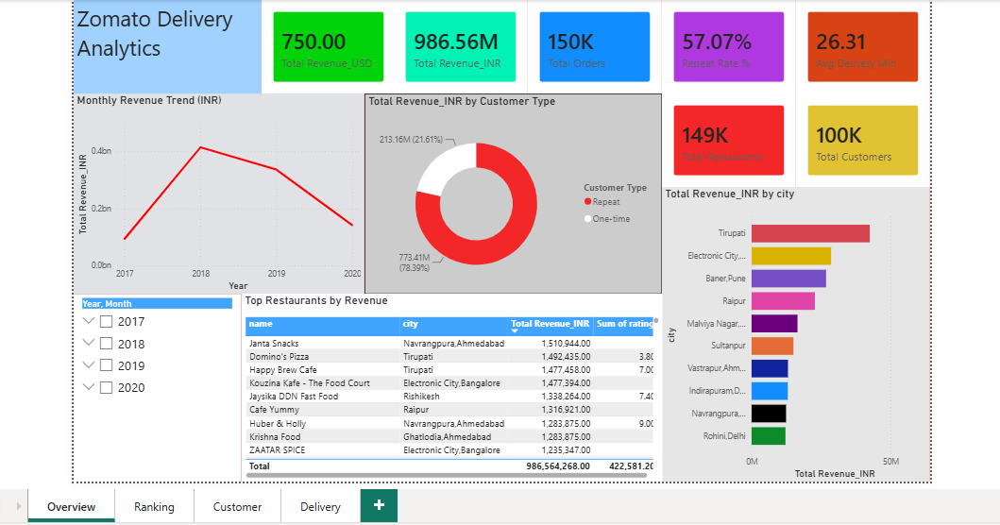
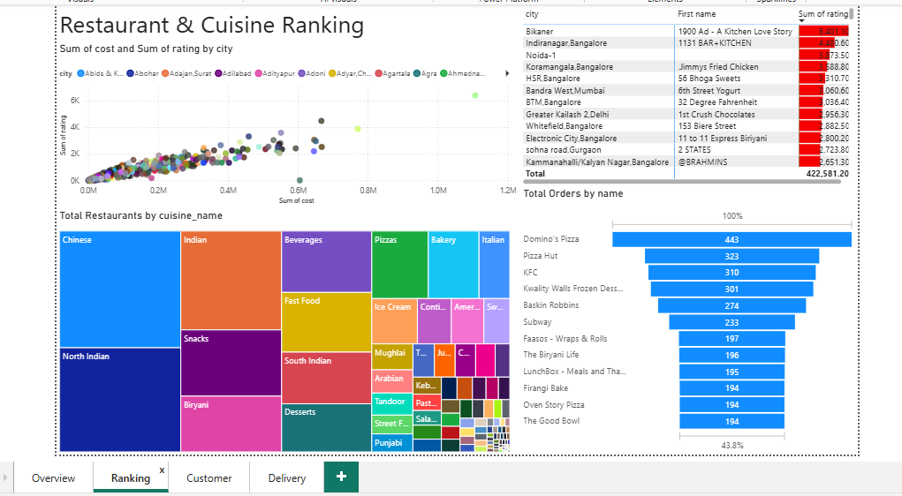
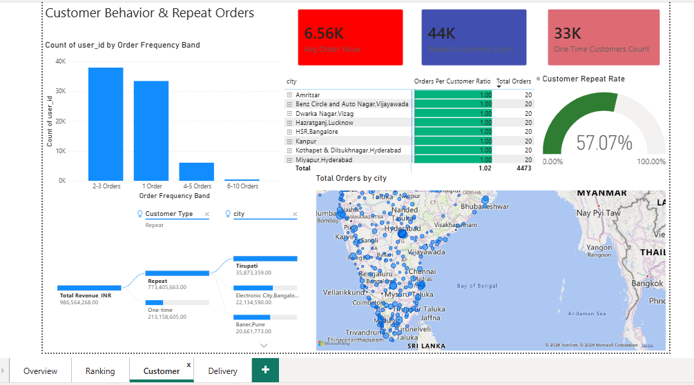
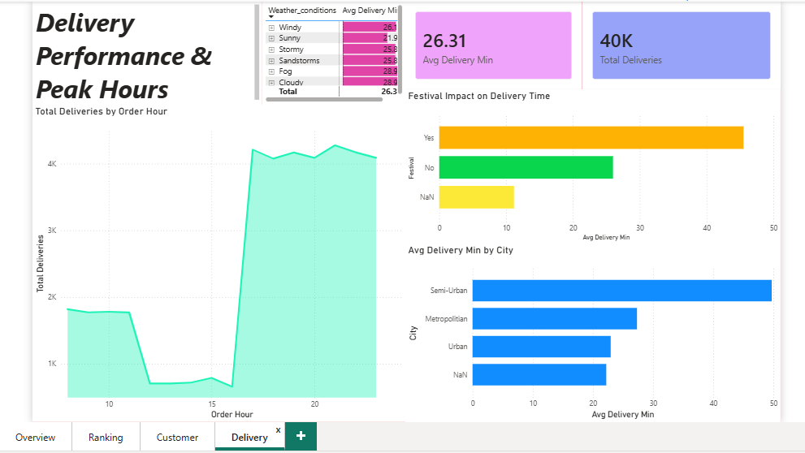

# Zomato Food Delivery Analytics (SQL Project)

End-to-end SQL analytics project on food delivery data — restaurant/cuisine ranking, revenue, repeat-customer behaviour, delivery performance, and peak-hour demand. Built in MySQL 8.0 / MySQL Workbench.

## Datasets (Kaggle)

| File | Source | Notes |
|---|---|---|
| `users.csv`, `restaurant.csv`, `orders.csv`, `food.csv`, `menu.csv` | "Zomato Database" dataset (`anas123siddiqui/zomato-database`) | Despite the dataset name, `restaurant.csv` links point to `swiggy.com` — this is actually Swiggy restaurant/order data. |
| `Zomato_Dataset.csv` | "Zomato Delivery Operations Analytics" (`saurabhbadole/...`) | Genuinely Zomato — but delivery-logistics fields only (no menu, price, or customer data). |

These two groups have **no shared key** — there's no way to join a real order to a real delivery record. `Database_analysis.sql` builds a synthetic one-to-one link (see below) purely so delivery metrics can be sliced by city/order-value for this project; it is not a real operational mapping.

## Schema

```
customers            -- from users.csv (password column dropped -- PII)
restaurants           -- from restaurant.csv, cleaned (rating '--'->NULL, '₹200'->200.00)
cuisines              -- distinct cuisines, split out of restaurants.cuisine
restaurant_cuisines   -- many-to-many junction (restaurant <-> cuisine)
food                  -- from food.csv
menu                  -- from menu.csv, links restaurant + food + price
orders                -- from orders.csv, surrogate order_id, is_valid_amount flag
delivery              -- from Zomato_Dataset.csv, surrogate delivery_id, synthetic order_id link
```

## Files

- **`Database_setup.sql`** — creates the database, staging tables (raw CSV mirrors), and final normalized tables; loads and cleans all 6 CSVs.
- **`Database_analysis.sql`** — 5 analysis sections (A–E) plus the synthetic delivery↔order link.

## Data quality issues found & fixed

| Issue | Where | Fix |
|---|---|---|
| Garbage backslash characters in text fields (`address`, `item`) breaking `LOAD DATA` column alignment | `restaurant.csv`, `food.csv` | `ESCAPED BY ''` in `LOAD DATA` |
| ~1,193 rows with junk text (`'₹200 FOR TWO'`) in a numeric `price` field | `menu.csv` | Staged as text, cast to `NULL` when it doesn't match a numeric pattern |
| Empty `r_id` (1,617 rows) breaking a strict-mode `DECIMAL` cast | `orders.csv` | Guarded the cast with `REGEXP` before casting |
| Negative `sales_amount` (e.g. `-1`) | `orders.csv` | Kept, flagged via `is_valid_amount = 0` (excluded from revenue, not deleted) |
| Time fields exported as Excel "fraction of day" decimals (e.g. `0.458333333` = 11:00) instead of `HH:MM` | `Zomato_Dataset.csv` | `REGEXP` check + `SEC_TO_TIME(ROUND(value * 86400))` |
| Trailing `\r` baked into the `currency` value itself (`'INR\r'`) for ~150K rows | `orders.csv` | `UPDATE orders SET currency = TRIM(currency);` after load |

## Analysis sections (`Database_analysis.sql`)

- **Section 0** — synthetic delivery↔order link (`ROW_NUMBER()` over a random shuffle)
- **Section A — Ranking** — top-rated restaurants by city, most popular cuisines, top restaurants by order volume, best-selling food items
- **Section B — Revenue** — by currency, by city, month-over-month trend, top restaurants, by cuisine (all excluding `is_valid_amount = 0` rows)
- **Section C — Repeat Orders** — repeat vs one-time customer rate, revenue share, restaurant-level loyalty, `LAG()` gap-between-orders
- **Section D — Average Delivery Time** — by city, weather/traffic, festival impact, vehicle type, and delivery time vs order value
- **Section E — Peak Hours** — hourly order volume, busiest-hour ranking, day-of-week patterns, lunch/dinner peak vs delivery speed

## Key findings

- Total INR revenue (valid orders): **₹96.4 crore** across ~147K orders
- **56.6% of customers are repeat customers** — and they drive ~78% of total revenue
- Overall average delivery time: **26.3 minutes**; jumps to **45.5 minutes on festival days**
- Semi-Urban deliveries are the slowest (~50 min avg) vs Urban (~23 min)
- **Peak order hour is 7 PM**, with a broader dinner-time surge (6 PM–11 PM) dominating over lunch
- Top cuisines by restaurant count: Chinese, North Indian, Indian

## How to run

1. Run `Database_setup.sql` top to bottom in MySQL Workbench (adjust the `LOAD DATA INFILE` paths to your own MySQL `Uploads` folder).
2. Run `UPDATE orders SET currency = TRIM(currency);` once, to clean the `\r` issue noted above.
3. Run `Database_analysis.sql` top to bottom.

## Power BI Dashboard

A 4-page interactive dashboard was built directly from the raw CSVs (Power Query handles the same cleaning steps as `Database_setup.sql`).

### Overview
KPI cards (Total Revenue, Total Orders, Repeat Rate, Avg Delivery Time, Total Restaurants, Total Customers), monthly revenue trend, revenue-by-customer-type donut, top-restaurants table, revenue-by-city bar chart, and a year/month slicer.



### Restaurant & Cuisine Ranking
Treemap of cuisine popularity, a rating-vs-cost scatter plot, a matrix of top-rated restaurants per city (with data bars), and a funnel of the top 10 restaurants by order volume.



### Customer Behaviour
A Decomposition Tree breaking down revenue by customer type / city / currency, a Repeat Rate gauge (vs a 60% target), an order-frequency-band distribution chart, a restaurant-loyalty matrix, and a city revenue map.



### Delivery Performance & Peak Hours
Avg delivery time and total-deliveries KPI cards, a weather-vs-traffic heatmap matrix, delivery time by city, an hourly order-volume area chart, and a festival-impact column chart.



