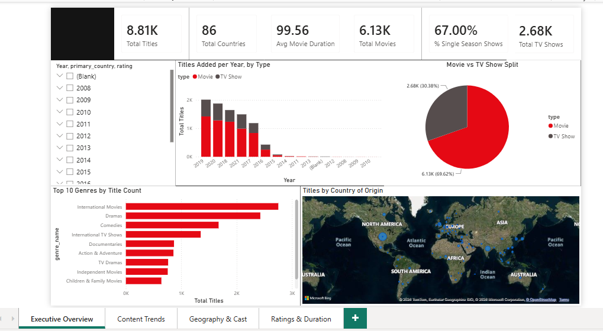
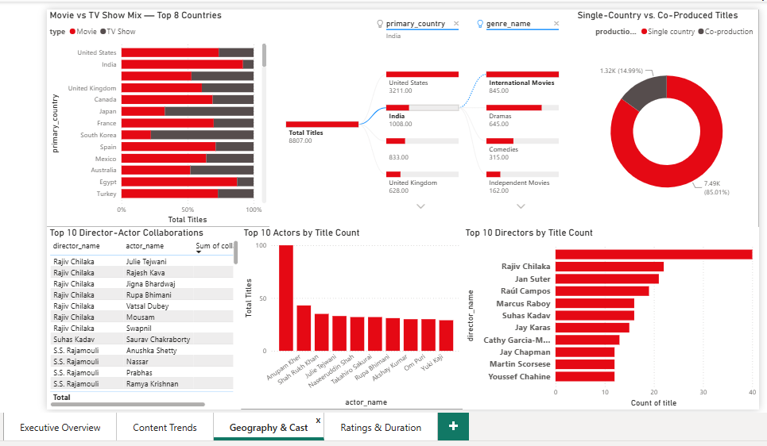
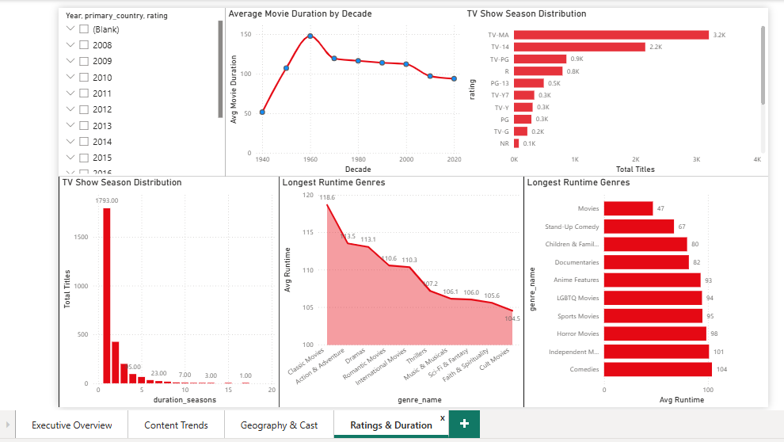

# 🎬 Netflix Content Analytics Project

[](https://www.mysql.com/)
[](https://powerbi.microsoft.com/)

Relational SQL analysis and an interactive 4-page Power BI dashboard on the Netflix Movies & TV Shows catalog — from raw CSV to a normalized MySQL database, 20 business-insight queries, and a fully interactive dashboard.

**Dataset:** [Netflix Movies and TV Shows (Kaggle)](https://www.kaggle.com/datasets/shivamb/netflix-shows) — `netflix_titles.csv`, 8,807 titles
**Tables:** `titles` · `genres` · `title_genres` · `actors` · `title_actors`

---

## 📁 Repo Structure

```
netflix-content-analytics/
├── sql/
│   ├── Database_setup.sql       # Schema + CSV import, cleaning, normalization
│   └── Database_analysis.sql    # 20 business-insight queries, 5 sections
├── dashboard/
│   ├── netflix_dashboard.pbix   # Power BI file
│   └── screenshots/
│       ├── overview.png
│       ├── content_trends.png
│       ├── geography_cast.png
│       └── rating_duration.png
└── README.md
```

> Folder names above are a suggestion — rename to match your actual repo layout before pushing.

## 🗄️ Database Schema

A raw, single flat CSV normalized into a proper relational structure:

```
staging_titles (raw landing table)
  -> titles (show_id PK, cleaned + typed)
  -> genres (genre_id PK) <-> title_genres (bridge)
  -> actors (actor_id PK) <-> title_actors (bridge)
```

| Table | Key columns |
|---|---|
| **titles** | type, title, director, country, date_added, release_year, rating, duration_minutes / duration_seasons, description |
| **genres** / **title_genres** | unique genre list, split from the comma-separated `listed_in` field via a recursive CTE |
| **actors** / **title_actors** | unique actor list, split from the comma-separated cast field via a recursive CTE |

## ⚙️ Setup

1. Run `Database_setup.sql` in MySQL Workbench (or the MySQL CLI) — it creates the database, loads `netflix_titles.csv` into `staging_titles`, applies a data-quality fix (a handful of rows have the duration value misplaced into `rating`), then populates `titles`, `genres`/`title_genres`, and `actors`/`title_actors`.
2. Update the `LOAD DATA INFILE` path in the script to point to where `netflix_titles.csv` lives on disk.
3. Each load/insert step is followed by a `SELECT COUNT(*)` check, and the script ends with a verification query across all six tables.
4. Run `Database_analysis.sql` (in full or section by section) to reproduce the 20 SQL insights.
5. Open `netflix_dashboard.pbix` in Power BI Desktop to explore the interactive dashboard, or import `netflix_titles.csv` directly via **Get Data → Text/CSV** if building from scratch.

> **Note:** `LOAD DATA INFILE` requires `secure_file_priv` to allow the source folder, or the file to sit in MySQL's configured secure upload directory. On the CLI you may need `LOAD DATA LOCAL INFILE` instead, depending on your server configuration.

## 📊 SQL Analysis — 20 Insights Across 5 Sections

`Database_analysis.sql` uses joins, subqueries, `CASE` expressions, and window functions (`RANK`) to answer:

**Section A — Content Trends**
Movie vs. TV Show split · library growth by year · release-to-addition freshness gap by type · seasonality by month added

**Section B — Genre Analysis**
Top genres by title count · genre evolution by average release year · genre mix for Movies vs. TV Shows · early vs. recent era genre focus

**Section C — Country & Geography**
Top content-producing countries · movie/TV ratio by country · top genre per top-5 country · single-country vs. co-production titles

**Section D — Actor & Director Analysis**
Top directors & actors by title count · frequent director-actor collaborations · type/country focus of the top-5 directors

**Section E — Ratings & Duration**
Content rating distribution · average movie duration trend by decade · TV show season-count distribution · longest/shortest average runtime by genre

## 📈 Power BI Dashboard

A 4-page interactive dashboard with a custom Netflix-branded theme (red/dark palette).

### Page 1 — Executive Overview
KPI cards (Total Titles, Total Countries, Avg Movie Duration, Total Movies, % Single Season Shows, Total TV Shows) · titles added per year by type · movie/TV split donut · top 10 genres by title count · titles by country of origin (map)



### Page 2 — Content Trends
Titles added by month (seasonality) · average gap: release year to Netflix add date, by type · top 10 genre additions over time (area chart) · top 5 genres for Movies vs. TV Shows · genre evolution: avg release year vs. popularity


### Page 3 — Geography & Cast
Movie vs. TV show mix by top 8 countries · drill-through by country → genre · single-country vs. co-produced titles (donut) · top 10 director-actor collaborations (table) · top 10 actors and directors by title count



### Page 4 — Ratings & Duration
Average movie duration by decade · TV show season distribution · content rating distribution · longest/shortest average runtime by genre



> Add your own screenshots to `dashboard/screenshots/` with the filenames above (or update the paths here) for the images to render on GitHub.

## 💡 Key Insights

- **Content mix:** Movies dominate the catalog — 6,131 titles (69.62%) vs. 2,676 TV Shows (30.38%). Growth exploded 2016-2019, then pulled back.
- **Freshness:** TV Shows are added far sooner after release than Movies — average gap of 2.3 years vs. 5.7 years.
- **Genres:** "International Movies" is the single biggest genre tag (2,752 titles); Movies and TV Shows have almost no overlap in their top-5 genres.
- **Geography:** The United States (3,211) and India (1,008) are the two dominant content-producing countries; India is the most Movie-skewed major country (92% Movie).
- **Cast & crew:** Rajiv Chilaka leads directors (19 titles, almost all Indian animated/children's content); Anupam Kher leads actors (43 titles) — Bollywood names dominate the top of the actor list; all top-5 directors are 100% Movie directors.
- **Ratings & duration:** TV-MA is the largest rating (3,207 titles, 36.44%); movie runtimes have shortened every decade since pre-2000; 67% of TV Shows never get renewed past a single season.

## 🛠️ Tech Stack

- **Database:** MySQL 8.0
- **Analysis:** SQL (joins, subqueries, `CASE` expressions, window functions — `RANK`, recursive CTEs for genre/cast normalization)
- **Dashboard:** Power BI Desktop, custom Netflix-branded theme

## 📄 License

Add a license (e.g. MIT) here if you intend this repo to be reused by others.
