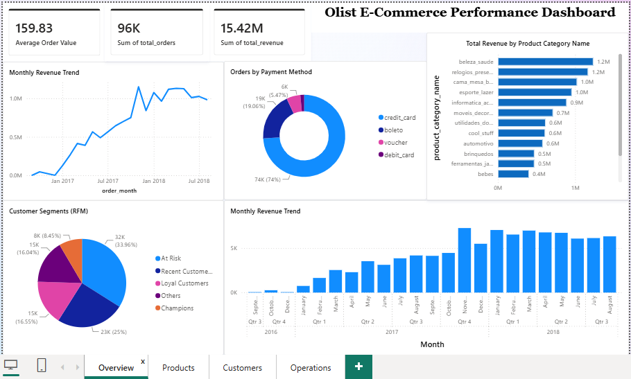
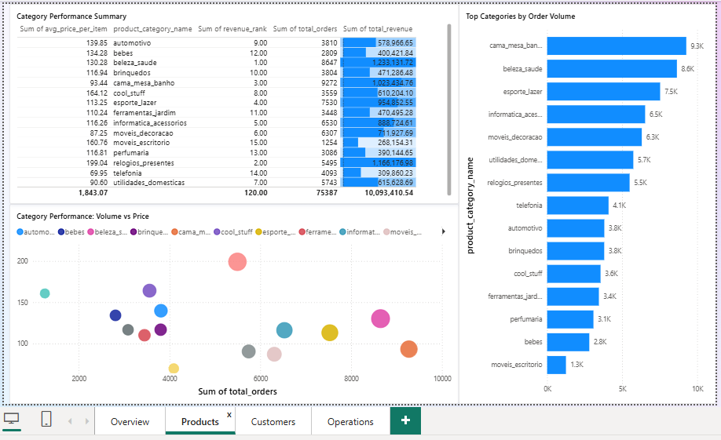
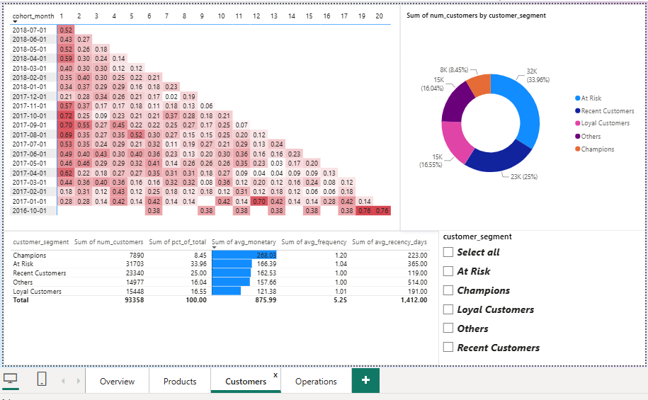
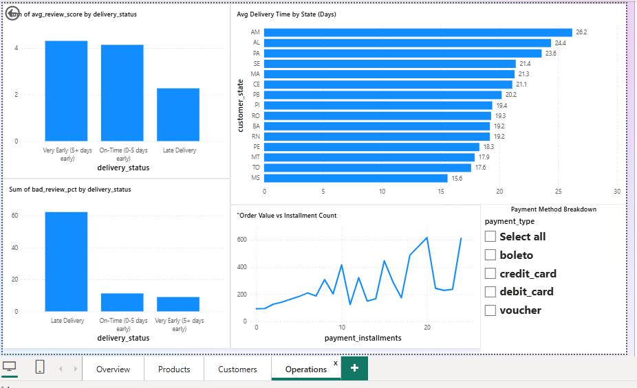

# Olist Brazilian E-Commerce — SQL Analysis & Power BI Dashboard

An end-to-end business analytics project built on the [Olist Brazilian E-Commerce Public Dataset](https://www.kaggle.com/datasets/olistbr/brazilian-ecommerce) — from database design in MySQL, through analytical SQL queries using CTEs and window functions, to an interactive 4-page Power BI dashboard.

The goal of this project was to simulate how a real e-commerce business would be analyzed end-to-end: not just "what happened," but *why it matters* and *what should be done about it*. Every SQL query is paired with a business-facing insight, and the dashboard is built to be something a stakeholder could actually use.

A companion Python/pandas EDA notebook on the same dataset is available in my [EDA_Projects](https://github.com/klsatapathy/EDA_Projects/tree/main/olist-ecommerce-eda) repo.

---

## 📖 About the Dataset

Olist is a Brazilian e-commerce marketplace that connects small businesses to major marketplaces. The public dataset contains ~100,000 real orders placed between 2016 and 2018, spread across 9 relational tables covering orders, customers, products, payments, reviews, and sellers.

---

## 🛠️ Tech Stack

| Tool | Used For |
|---|---|
| **MySQL / MySQL Workbench** | Schema design, data import & cleaning, query development |
| **SQL** (CTEs, window functions) | `LAG`, `RANK`, `NTILE`, `MIN() OVER (PARTITION BY ...)`, `TIMESTAMPDIFF` |
| **Power BI Desktop** | Interactive dashboard, DAX measures, direct MySQL connection via custom SQL |

---

## 📁 Folder Structure

```
olist_ecommerce/
├── README.md
├── database_setup.sql          # Schema creation (9 tables)
├── olist_ecommerce_analysis.sql # 8 analysis queries + inline insights
├── Olist_Ecommerce_Dashboard.pbix
├── Dataset/                    # Raw CSVs used to populate the database
└── screenshots/                # Dashboard page exports
    ├── overview.png
    ├── products.png
    ├── customers.png
    └── operations.png
```

---

## 🗄️ Part 1: Database & SQL Analysis

### Schema (`database_setup.sql`)
A 9-table relational schema was built in MySQL Workbench, mirroring the raw Olist CSVs: `orders`, `customers`, `order_items`, `products`, `order_reviews`, `order_payments`, `sellers`, `geolocation`, and `product_category_name_translation`. One notable data-cleaning step: the raw `order_reviews` CSV contained embedded newlines and backslashes in free-text review comments that broke direct import — this was cleaned with a Python pre-processing pass before loading.

### Analysis (`olist_ecommerce_analysis.sql`)
8 queries organized into 5 sections, each closing with a `/* INSIGHT */` comment written the way a business stakeholder would want it framed — not just the number, but the "so what."

1. **Revenue & Growth Trends**
   - Monthly revenue and order volume
   - Month-over-month growth % using `LAG()` (with the 2016 pilot-phase months excluded from growth calculations to avoid outlier distortion)

2. **Product Performance**
   - Top categories by revenue using `RANK()`
   - Volume vs. average price trade-off across categories

3. **Customer Segmentation (RFM)**
   - Recency, Frequency, Monetary scoring via `NTILE(4)`
   - Customers bucketed into segments: Champions, Loyal Customers, Recent Customers, At Risk, Others

4. **Cohort Retention**
   - Monthly acquisition cohorts tracked over time using `MIN() OVER (PARTITION BY customer_unique_id)` and `TIMESTAMPDIFF`
   - Retention % calculated per cohort per month since first purchase

5. **Operations**
   - Delivery timeliness vs. review score
   - Delivery time by customer state (geographic breakdown)
   - Payment method mix and installment behavior vs. order value

**15 total business insights** are documented as inline comments throughout the script — the SQL file itself reads like a lightweight analyst report.

---

## 📊 Part 2: Power BI Dashboard

A 4-page interactive dashboard connects directly to the MySQL database via custom SQL (Advanced Options in Power BI's MySQL connector), rather than importing raw tables — each visual is backed by a pre-aggregated, purpose-built query.

### Page 1 — Overview
KPI cards (Total Revenue, Total Orders, Average Order Value via a DAX `DIVIDE()` measure), monthly revenue trend, month-over-month growth, order volume by month, RFM segment donut, and payment method breakdown.



### Page 2 — Products
Category performance summary table, a volume-vs-price bubble chart (bubble size = revenue) showing the trade-off between high-volume/low-margin and low-volume/high-margin categories, and top categories by revenue/order count.



### Page 3 — Customers
A cohort retention heatmap (matrix visual with conditional background color, month-0 and undersized cohorts filtered out to keep the color scale meaningful), plus an RFM segment table and donut chart.



### Page 4 — Operations
Delivery status vs. average review score and negative-review rate, delivery time by state, order value vs. installment count, and a payment method breakdown.



> **Note on access:** The `.pbix` file requires Power BI Desktop to open (free download). A live published version isn't available since Power BI Service publishing requires a work/school Microsoft account — the screenshots above capture the full interactive dashboard.

---

## 🔑 Key Business Insights

- **Growth:** Orders scaled from ~750/month (Jan 2017) to a stable ~6,000–7,000/month by 2018. A clear Black Friday seasonal spike (+53.5% MoM) appears in November 2017, followed by a natural December cooldown.
- **Products:** Health & Beauty and Watches/Gifts are high-margin categories despite lower order volumes; Bed/Bath/Table drives the most volume but at a lower average price — a candidate for bundling strategies.
- **RFM:** Champions make up only ~8.5% of customers but have the highest average spend — a clear Pareto (80/20) pattern. "At Risk" is the largest single segment (~34% of customers, average recency of ~1 year) — the biggest revenue win-back opportunity on the platform.
- **Retention:** Every acquisition cohort shows Month-1 retention below 1%, collapsing from 100% at Month 0 — not a gradual decline but a cliff. This is independently confirmed by the near-universal ~1.0 average purchase frequency seen in the RFM analysis. Olist behaves as a largely one-time-purchase marketplace.
- **Delivery:** Late deliveries nearly halve the average review score (4.31 → 2.27) and carry a ~62% negative-review rate — roughly 7x higher than very-early deliveries — pointing to systemic logistics issues in a subset of orders rather than random variance.
- **Geography:** North/Northeast Brazilian states (Amazonas, Alagoas, Pará, Maranhão) see delivery times 2–3x longer than the national benchmark, reflecting Brazil's well-documented regional infrastructure gap.
- **Payments:** Credit card accounts for 74% of orders. Average order value scales consistently with installment count — nearly doubling from 1 installment (~R$96) to 5 installments (~R$183) — indicating installments function as a purchasing enabler for higher-ticket items.

---

## ▶️ Running This Locally

1. Run `database_setup.sql` in MySQL Workbench to create the 9-table schema.
2. Import the CSVs from `Dataset/` into their corresponding tables.
3. Run `olist_ecommerce_analysis.sql` for the full analysis — each section includes its business insight as a comment.
4. Open `Olist_Ecommerce_Dashboard.pbix` in Power BI Desktop. Update the MySQL connection string (server/database) in Power Query if your local setup differs, then Refresh.

---

## 🔗 Related Work

A Python/pandas EDA notebook covering the same dataset and business questions (revenue, RFM, cohort retention, delivery, payments) with matplotlib/seaborn visualizations is available here: [EDA_Projects/olist-ecommerce-eda](https://github.com/klsatapathy/EDA_Projects/tree/main/olist-ecommerce-eda).

---

## 👤 Author

**Lokanath Satapathy**
Python & Data Science student, building a portfolio spanning SQL, BI, and Python-based analysis.
[GitHub](https://github.com/klsatapathy) · [LinkedIn](https://www.linkedin.com/in/lokanath-satapathy-9271732a2)
