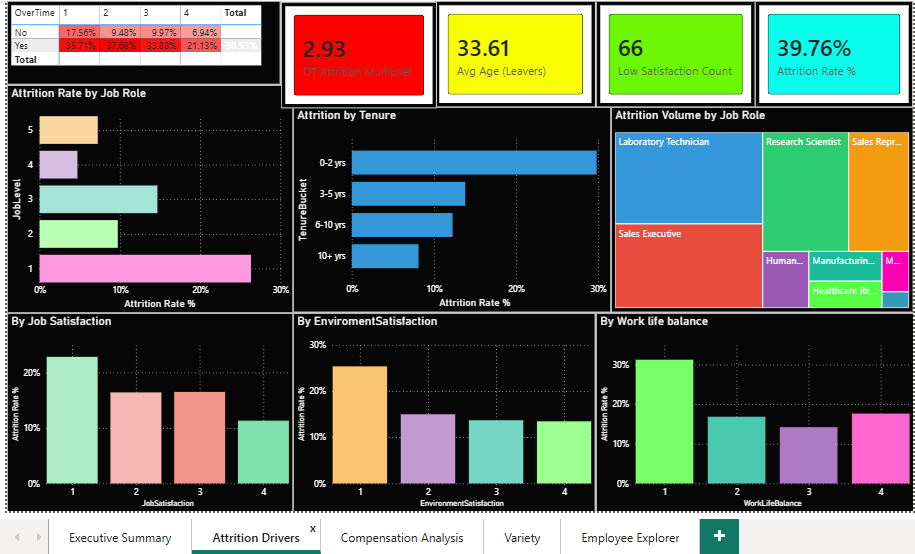
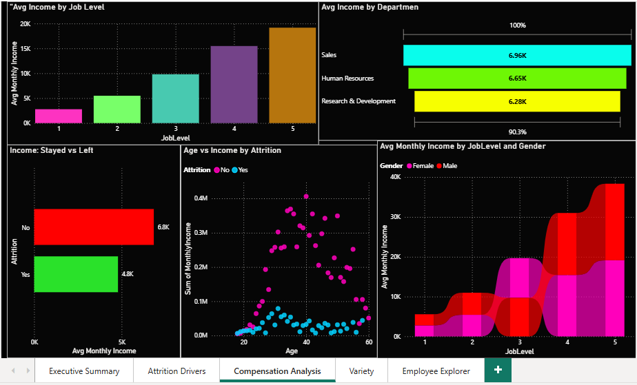
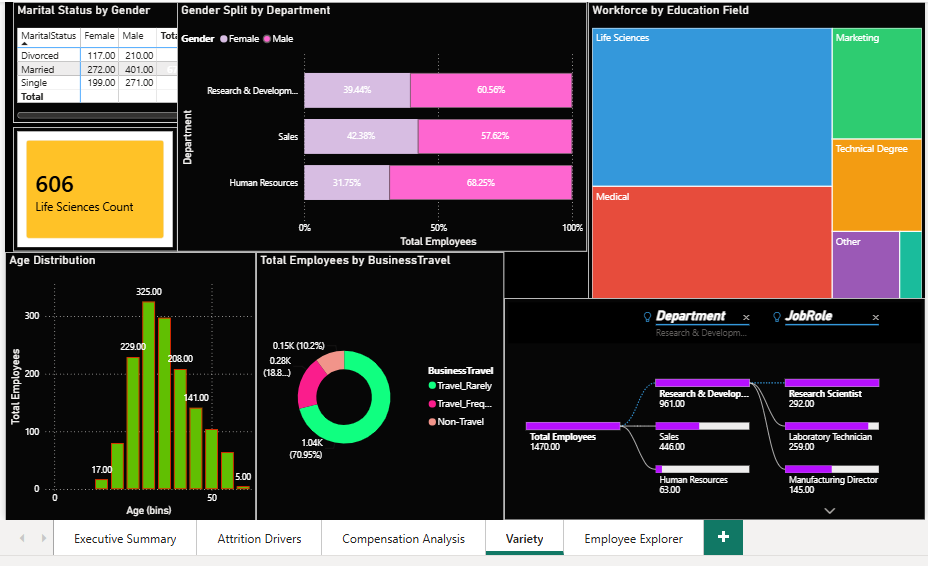

# 👥 HR Employee Attrition Analysis Project

[](https://www.python.org/)
[](https://powerbi.microsoft.com/)
[]()

An end-to-end statistical analysis of employee attrition — from raw HR data to a full exploratory analysis with hypothesis testing, and a 5-page interactive Power BI dashboard.

**Dataset:** [IBM HR Analytics Employee Attrition & Performance (Kaggle)](https://www.kaggle.com/datasets/pavansubhasht/ibm-hr-analytics-attrition-dataset)
**Size:** 1,470 employees × 35 features

---

## 📁 Repo Structure

```
hr_attrition_eda/
├── eda/
│   └── HR_Attrition_EDA_GitHub.ipynb   # Python EDA (pandas, seaborn, matplotlib, scipy)
├── data/
│   └── WA_Fn-UseC_-HR-Employee-Attrition.csv
├── dashboard/
│   ├── HR_Attrition_Dashboard.pbix     # Power BI file
│   └── screenshots/
│       ├── executive_summary.png
│       ├── attrition_drivers.png
│       ├── compensation_analysis.png
│       ├── demographics.png
│       └── employee_explorer.png
└── README.md
```

> Folder names above are a suggestion — rename to match your actual repo layout before pushing.

## ⚙️ Setup

1. Open `HR_Attrition_EDA_GitHub.ipynb` in Jupyter, point it at `data/WA_Fn-UseC_-HR-Employee-Attrition.csv`, and run all cells to reproduce the full statistical analysis.
2. Open `HR_Attrition_Dashboard.pbix` in Power BI Desktop to explore the interactive dashboard, or import the CSV directly via **Get Data → Text/CSV** if building from scratch.

## 📊 Python EDA — Full Statistical Breakdown

`HR_Attrition_EDA_GitHub.ipynb` covers every feature in the dataset, not just a hand-picked subset:

**1. Data Quality Audit** — missing values, duplicates, zero-variance columns

**2. Descriptive Statistics** — mean, median, mode, variance, standard deviation, skewness, and kurtosis for all 14 continuous and 9 ordinal features

**3. Univariate Distributions** — histogram + KDE grids for every continuous and ordinal feature

**4. Outlier Audit** — systematic IQR-based outlier detection across every continuous feature

**5. Categorical Feature Profile** — frequency breakdown of every categorical feature

**6. Attrition Rate by Feature** — attrition-rate comparison against the company baseline for every categorical and ordinal feature, including job-role risk ranking

**7. Attrition vs. Continuous Features** — boxplot comparison (Stayed vs. Left) plus **Welch's t-tests** to confirm which numeric differences are statistically significant

**8. Correlation Structure** — full correlation heatmap and ranked correlation with attrition

**9. Multivariate Deep Dives** — OverTime × JobSatisfaction risk heatmap, age-vs-income scatter, tenure-bucket attrition, gender pay-gap check

**10. Key Findings & Recommendations** — summarized, business-facing conclusions

## 📈 Power BI Dashboard — 5 Pages

A 5-page interactive dashboard covering the full attrition story, from headline KPIs to individual-employee drill-down.

### Page 1 — Executive Summary
KPI cards (Total Employees, Attrition Count, Attrition Rate %, Avg Tenure, Avg Income) · attrition gauge vs. target · attrition by department, gender & overtime · marital status split · top-5 job role attrition · income-band attrition · key-insight callouts


### Page 2 — Attrition Drivers
Job role attrition ranking · satisfaction-score breakdown (Job / Environment / Work-Life Balance) · OverTime × Job Satisfaction risk heatmap · tenure-bucket attrition · stock-option-level attrition · risk-segment KPI cards



### Page 3 — Compensation Analysis
Income by job level · income comparison (Stayed vs. Left) · age-vs-income scatter by attrition · income by department (funnel) · gender pay-gap check by job level (ribbon chart)



### Page 4 — Demographics & Workforce Profile
Age distribution · workforce by education field & department (treemaps) · business travel frequency · marital status × gender matrix · gender split by department



### Page 5 — Employee Explorer
Filterable employee-level table with conditional formatting · synced slicers (Department, Job Role, OverTime, Attrition) · live-filtered KPI cards · attrition trend by tenure year · headcount vs. attrition rate by department (combo chart)


> Add your own screenshots to `dashboard/screenshots/` with the filenames above for the images to render on GitHub.

## 💡 Key Insights

- **Overall attrition rate: 16.12%** (237 of 1,470 employees) — the baseline every subgroup is measured against.
- **OverTime is the strongest single driver** — employees working overtime leave at roughly 3x the rate of those who don't, and the risk compounds further when combined with low job satisfaction.
- **Job role matters a lot:** Sales Representatives (~39.8%) and Laboratory Technicians (~23.9%) attrit far above every other role.
- **The first 2 years are the critical retention window** — new hires attrit at nearly double the company average; risk drops sharply after year 3.
- **Compensation and age are real levers** — employees who left earn visibly less and skew younger; the young + low-income segment is the most concentrated attrition risk.
- Welch's t-tests confirm `TotalWorkingYears`, `Age`, `MonthlyIncome`, `YearsAtCompany`, `YearsInCurrentRole`, and `YearsWithCurrManager` differ significantly (p < 0.05) between employees who left and stayed.
- No meaningful gender pay gap detected once job level is controlled for.

## 🛠️ Tech Stack

- **Analysis:** Python (pandas, numpy, matplotlib, seaborn, scipy — descriptive statistics & Welch's t-tests)
- **Dashboard:** Power BI Desktop (DAX measures, calculated columns, matrix conditional formatting, synced slicers, decomposition-style drill views)

## 🔗 Related

A companion Plotly-based interactive EDA notebook (published on Kaggle) is available in the [EDA_Projects]([https://www.kaggle.com/code/lokanathsatapathy/ibm-hr-analytics-eda]) repository under `hr-attrition-eda/`.
